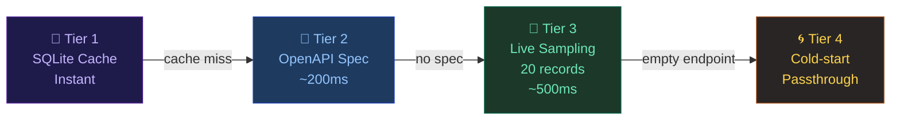
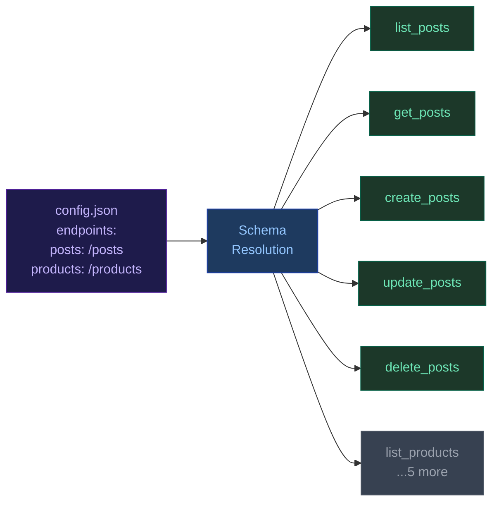
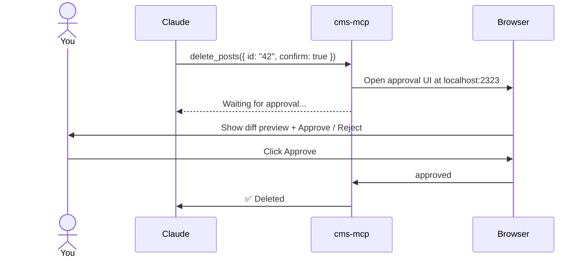
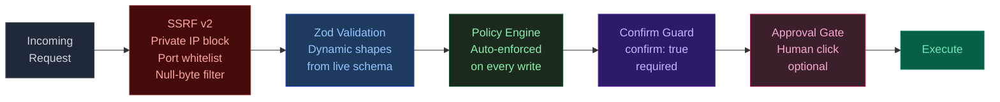

<div align="center">


[](https://git.io/typing-svg)

<br/>

[](https://www.npmjs.com/package/cms-mcp)
[](https://modelcontextprotocol.io)
[](#testing)
[](https://www.typescriptlang.org/)
[](https://nodejs.org/)
[](LICENSE)

<br/>

[**Quick Start**](#quick-start) · [**Tools**](#tools-reference) · [**Advanced**](#advanced-features) · [**Security**](#security) · [**Docs**](./docs)

</div>

---

## What it looks like

```
You:    "Scan my latest GitHub repo and publish it as a portfolio project"
Claude: Done — scanned, policy-checked, diff shown, awaiting your approval...
        [You click Approve in browser]
Claude: Published. ✅

You:    "Have I written about LSTMs before? If so, link to it in this new article."
Claude: Yes — found Deep Learning Fundamentals (87% match). Linking now.

You:    "List my draft products"
Claude: Found 8 products: Widget Pro (draft), Gadget X (draft)...

You:    "Create a new author named Jane Doe with email jane@example.com"
Claude: ✅ Author created! ID: a1b2c3
```

**Works with any REST JSON API** — Supabase, PocketBase, Payload CMS, Directus, Strapi, custom Next.js/Express/FastAPI routes, or any backend that speaks JSON over HTTP.

---

## How it works

cms-mcp reads your API's shape at startup, builds typed MCP tools from that shape, and registers them before Claude connects.

### Schema resolution — 4-tier priority chain



**Why OpenAPI first?** Sampling records misses optional fields and fails on empty endpoints. An OpenAPI spec declares every field, format, required status, and enum value explicitly. If your API has a spec, cms-mcp uses it.

**Sampling fallback:** 20 records are fetched and merged into a union schema. Fields absent from even one record are flagged `inconsistent: true` and always use `.optional()` in generated Zod shapes — no false "required" errors.

### What gets built per endpoint



For every key in `config.endpoints` (except `media`), exactly **5 tools** are registered. Schemas are cached in SQLite — next startup hits Tier 1 instantly.

---

## Installation

```bash
# Zero install — just run
npx cms-mcp --config ./cms-mcp.config.json

# Or install globally
npm install -g cms-mcp

# Or from source
git clone https://github.com/parnish007/cms-mcp
cd cms-mcp && npm install && npm run build
node build/index.js --config ./cms-mcp.config.json
```

---

## Quick Start

### 1. Create your config

```json
{
  "baseUrl": "https://your-api.com/api",
  "auth": {
    "type": "bearer",
    "token": "env:CMS_API_TOKEN"
  },
  "endpoints": {
    "posts":    "/posts",
    "projects": "/projects",
    "products": "/products",
    "authors":  "/authors",
    "media":    "/uploads"
  }
}
```

Any endpoint key works. At startup, cms-mcp generates `list_posts`, `get_posts`, `create_posts`, `update_posts`, `delete_posts` — and 5 more for every other endpoint — with schemas built from your API's actual fields.

Or skip manual config entirely:

```bash
npx cms-mcp init --base-url https://your-api.com/api
```

### 2. Get your API token

<details>
<summary><b>Where to get tokens for each CMS</b></summary>

| CMS | Location |
|-----|----------|
| Supabase | Project Settings → API → `anon` or `service_role` key |
| Strapi | Settings → API Tokens → Create new |
| Directus | Settings → Access Tokens → Create Token |
| PocketBase | `POST /api/collections/users/auth-with-password` → `token` field |
| Payload CMS | Admin → Users → your user → API Key |
| Custom backend | Whatever your backend requires |

Full instructions: **[docs/env-vars.md](./docs/env-vars.md)**

</details>

```bash
export CMS_API_TOKEN=your-token-here
```

### 3. Connect to Claude

**Claude Desktop** (`~/Library/Application Support/Claude/claude_desktop_config.json`):
```json
{
  "mcpServers": {
    "cms-mcp": {
      "command": "npx",
      "args": ["cms-mcp", "--config", "/path/to/cms-mcp.config.json"],
      "env": { "CMS_API_TOKEN": "your-token-here" }
    }
  }
}
```

**Claude Code:**
```bash
claude mcp add cms-mcp -- npx cms-mcp --config ./cms-mcp.config.json
```

### 4. Talk to Claude

```
"List my draft posts"
"Create a product called Widget Pro with price 29.99"
"Inspect the schema of my authors endpoint"
"Refresh the schema for products and tell me what changed"
```

---

## Tools Reference

### Per-endpoint tools

| Tool | What it does |
|------|-------------|
| `list_X` | Filter, paginate, full-text search. Enum fields become optional filter params. |
| `get_X` | Fetch single record by ID. |
| `create_X` | Create new record. `preview: true` shows field table without writing. |
| `update_X` | Update by `id`. `preview: true` shows a diff before committing. |
| `delete_X` | Delete by `id`. Requires `confirm: true` — shows warning otherwise. |

**Examples:**
```
"Preview creating a post titled Hello World"
→ create_posts({ title: "Hello World", status: "draft", preview: true })

"Update post 42, set status to published"
→ update_posts({ id: "42", status: "published", confirm: true })

"Delete post 42"
→ delete_posts({ id: "42", confirm: true })
```

Foreign-key fields (`author_id`, `tag_ids`) are auto-detected and surfaced as relation hints in tool descriptions — Claude knows which tool to call to resolve related records.

<details>
<summary><b>Legacy mode (v0.5 compatibility)</b></summary>

Set `legacyMode: true` to revert to the v0.5 `mutate_X` combined tool:
```json
{ "legacyMode": true }
```
```
→ mutate_posts({ action: "create", data: { title: "Hello World" }, confirm: true })
```
Useful if you have saved Claude prompts that reference `mutate_X` by name.

</details>

### Always-available tools

| Category | Tools |
|----------|-------|
| **Media** (if `"media"` key configured) | `upload_media_from_url` · `list_media` · `delete_media` |
| **Introspection** | `discover_api` · `apply_discovered_endpoints` · `inspect_endpoint_schema` · `refresh_resource_schema` · `list_configured_endpoints` · `cache_stats` · `clear_cache` |
| **Policy** | `check_policies` · `init_policies` |

### Optional plugin tools

| Plugin | Config required | Tools added |
|--------|----------------|------------|
| Semantic search | `"schemaCache"` block | `semantic_search` · `sync_all_content` · `knowledge_status` |
| GitHub | `"github"` block + `GITHUB_TOKEN` | `scan_repo` · `sync_repo_to_project` · `list_repos` |

### MCP Resources

One resource pair per configured endpoint:
```
cms://posts          → list all posts
cms://posts/{id}     → single post (HTML distilled to Markdown)
```

---

## Advanced Features

### Human Approval Gate

Every write pauses for a human click before executing.



**Enable:**
```bash
npx cms-mcp --config ./config.json --approval
```

Or scope to specific tools:
```json
{
  "approvals": {
    "port": 2323,
    "timeoutMs": 300000,
    "tools": ["delete_posts", "delete_products", "create_posts"]
  }
}
```

Auto-rejects after 5 minutes. See [docs/advanced/approval-gate.md](./docs/advanced/approval-gate.md).

---

### Semantic Search

**TF-IDF (no API key):**
```json
{ "schemaCache": { "path": "~/.cms-mcp/schema.db" } }
```

**True semantic similarity (OpenAI):**
```json
{
  "schemaCache": { "path": "~/.cms-mcp/schema.db" },
  "embedding": {
    "provider": "openai",
    "apiKey": "env:OPENAI_API_KEY",
    "model": "text-embedding-3-small"
  }
}
```

```
"Have I written about machine learning before? Link to it in this new article."
→ Found: Deep Learning Fundamentals (87% match), Neural Net Tutorial (73% match)
```

---

### Policy Engine

Policies are **auto-enforced** on every `create_X`, `update_X`, and `delete_X` — no manual step needed.

```json
{
  "version": "1",
  "rules": [
    {
      "type": "required_fields",
      "fields": ["cover_image", "seo_title", "seo_description"],
      "tools": ["update_posts", "update_projects"]
    },
    {
      "type": "forbidden_words",
      "field": "body",
      "words": ["TODO", "lorem ipsum"],
      "tools": ["create_posts", "update_posts"]
    },
    {
      "type": "min_tags",
      "min": 2,
      "tools": ["create_projects"]
    }
  ]
}
```

<details>
<summary><b>All 10 rule types</b></summary>

`required_fields` · `min_tags` · `max_tags` · `min_length` · `max_length` · `forbidden_words` · `require_cover_image` · `seo_required` · `regex_match` · `status_transition`

Rule `tools` arrays accept both v1.0.0 names (`create_X`) and legacy names (`mutate_X`) interchangeably.

</details>

Generate a starter file: `"Initialize policies for my CMS"`

See [docs/advanced/policy-engine.md](./docs/advanced/policy-engine.md).

---

### CMSAdapter — Field Mapping

Some CMS APIs use internal field names that differ from what Claude sees. The `adapters` block handles this bidirectionally:

```json
{
  "adapters": {
    "posts": {
      "updateMethod": "PUT",
      "fieldMap": {
        "title":  "post_heading_1",
        "body":   "post_content_markdown",
        "status": "publication_state"
      }
    }
  }
}
```

Claude uses the left-hand names. The API receives the right-hand names. Responses are reverse-mapped before returning to Claude.

---

### Schema → Zod Type Mapping

<details>
<summary><b>Full type mapping table</b></summary>

| OpenAPI / inferred type | Zod validator |
|------------------------|---------------|
| `string` / `format: uuid` | `z.string().uuid()` |
| `string` / `format: date-time` | `z.string().datetime()` |
| `string` / `format: uri` | `z.string().url()` |
| `string` / `format: email` | `z.string().email()` |
| `enum: ["a","b","c"]` | `z.enum(["a","b","c"])` |
| `string` | `z.string()` |
| `integer` / `number` | `z.number()` |
| `boolean` | `z.boolean()` |
| `array` | `z.array(z.unknown())` |
| `object` | `z.record(z.unknown())` |
| `nullable: true` | base type `.nullable()` |
| `readOnly: true` (OpenAPI) | excluded from create/update inputs |

</details>

---

## Configuration

<details>
<summary><b>Full config reference</b></summary>

```json
{
  "name": "My Site",
  "baseUrl": "https://your-api.com/api",

  "auth": {
    "type": "bearer",
    "token": "env:CMS_API_TOKEN"
  },

  "endpoints": {
    "posts":    "/posts",
    "projects": "/projects",
    "products": "/products",
    "authors":  "/authors",
    "events":   "/events",
    "media":    "/uploads"
  },

  "github": {
    "token":        "env:GITHUB_TOKEN",
    "defaultOwner": "your-username"
  },

  "readOnly": false,
  "auditLog": "~/.cms-mcp/audit.log",
  "policies": "./cms-mcp.policies.json",

  "schemaCache": {
    "path":       "~/.cms-mcp/schema-cache.db",
    "ttlMinutes": 60
  },

  "embedding": {
    "provider": "openai",
    "apiKey":   "env:OPENAI_API_KEY",
    "model":    "text-embedding-3-small"
  },

  "approvals": {
    "port":      2323,
    "timeoutMs": 300000,
    "tools":     ["delete_posts", "delete_products"]
  },

  "adapters": {
    "posts": {
      "updateMethod": "PUT",
      "fieldMap": {
        "title": "post_heading_1",
        "body":  "post_content_markdown"
      }
    }
  },

  "legacyMode":   false,
  "allowedPorts": [3000, 8080],

  "openapi": {
    "autoDiscover": true,
    "discoveryUrl": "https://your-api.com/api/docs/openapi.json"
  },

  "webhook": {
    "port":   3001,
    "secret": "env:WEBHOOK_SECRET",
    "path":   "/webhook"
  }
}
```

**Auth types:**

| Type | Config |
|------|--------|
| Bearer token | `{ "type": "bearer", "token": "env:MY_TOKEN" }` |
| API key header | `{ "type": "api-key", "header": "X-API-Key", "token": "env:MY_KEY" }` |
| HTTP Basic | `{ "type": "basic", "username": "admin", "password": "env:MY_PASS" }` |
| No auth | `{ "type": "none" }` |

Any value prefixed with `env:` is resolved from the environment at startup. Secrets are **never** written to logs.

</details>

**CLI flags:**

| Flag | Description |
|------|-------------|
| `--config <path>` | Config file path |
| `--readonly` | Disable all write tools |
| `--approval` | Enable approval gate |
| `--webhook` | Start GitHub webhook listener |
| `--no-discover` | Skip OpenAPI auto-discovery |

---

## Security



| Protection | Detail |
|-----------|--------|
| **SSRF v2** | Blocks private IPs (RFC 1918), loopback, AWS/GCP/Azure metadata (`169.254.169.254`), IPv6 ULA, non-HTTP schemes, null bytes |
| **Port whitelist** | Only 80 and 443 by default — add extras via `allowedPorts` |
| **SecretManager** | Secrets tokenized after `loadConfig()` — never held plain-text in the Config object; resolved only at the moment of the HTTP call |
| **No redirect following** | `redirect: "error"` on all fetch calls — prevents redirect-based SSRF |
| **Timeouts** | 30s `AbortController` on every outbound request |
| **Media cap** | 50 MB upload limit |
| **Secret redaction** | Recursive redaction of all secret field names in audit logs |
| **Input validation** | Zod shapes from live schema — every input validated at runtime |
| **Confirm guards** | All destructive operations require `confirm: true` |
| **Webhook HMAC** | Constant-time SHA-256 signature verification |
| **Read-only mode** | `--readonly` disables all writes |

See [docs/security.md](./docs/security.md) · Report vulnerabilities via [SECURITY.md](./SECURITY.md).

---

## Testing

```bash
npm test
```

**78 tests, 6 suites, Node native test runner (no Jest/Mocha/Vitest):**

| Suite | Tests | What's covered |
|-------|-------|---------------|
| Policy Engine | 15 | All 10 rule types, tool scoping, multi-rule violations |
| Content Distiller | 14 | HTML→Markdown, field stripping, metadata headers, pipeline |
| Circuit Breaker | 10 | Full lifecycle, cached fallback, reset, status |
| Vector Cache | 10 | Store, async search, TF-IDF, custom embedFn, type filter, clear |
| OpenAPI | 6 | Formatting, empty resources, missing fields |
| Security | 23 | SSRF (15 URL patterns), null bytes, long URLs, auth URLs |

---

## Current Limitations

<details>
<summary><b>View limitations and workarounds</b></summary>

| Limitation | Workaround |
|-----------|------------|
| **Tool shapes fixed at connect time** — schema changes require restart | `refresh_resource_schema` updates SQLite cache; then restart |
| **No nested/relational writes** — top-level fields only | Post top-level record, then use secondary tools for relations |
| **Sampling can miss rare fields** — Tier 3 samples 20 records | Use OpenAPI spec (Tier 2) or `discover_api` + `refresh_resource_schema` |
| **CompensatingTransaction is not atomic** — REST has no transaction primitive | On `CriticalInconsistencyError`, `orphanedIds` lists records needing manual cleanup |
| **No pagination abstraction** — `list_X` fetches a single page | Pass `limit`/`page` args manually, or use `sync_all_content` |
| **`media` key is reserved** | Name your media endpoint `"media"` — gets file upload tools automatically |
| **Single base URL** — one auth config per instance | Run a second cms-mcp instance for a second API |
| **No GraphQL** | Use a REST wrapper or Hasura REST endpoints in front of GraphQL |

</details>

---

## Supported CMS Platforms

Supabase · PocketBase · Payload CMS · Directus · Strapi · Custom Next.js/Express/FastAPI · Any REST JSON API

Ready-made config files: [`examples/`](./examples/)

**Normalized response shapes** (all handled automatically):
`[{...}]` · `{ "data": [...] }` · `{ "items": [...] }` · `{ "results": [...] }` · `{ "records": [...] }` · `{ "nodes": [...] }` · `{ "collection": [...] }`

---

## Docker

```bash
# Build and run
docker build -t cms-mcp .
docker run -v $(pwd)/cms-mcp.config.json:/app/config.json \
  -e CMS_API_TOKEN=your-token \
  cms-mcp --config /app/config.json

# Or with compose
docker compose up
```

Multi-stage Alpine build (`node:22-alpine`) — ~45MB image. Uses `dumb-init` for proper PID 1 signal handling.

---

## Documentation

<details>
<summary><b>Full docs index</b></summary>

| Doc | Description |
|-----|-------------|
| [Getting Started](./docs/getting-started.md) | Install, configure, first conversation |
| [Environment Variables](./docs/env-vars.md) | Tokens from every CMS |
| [Configuration](./docs/configuration.md) | Full config schema reference |
| [Generic Resource Tools](./docs/tools/generic-resource.md) | How schema-driven tools work |
| [Media Tools](./docs/tools/media.md) | Upload, list, delete |
| [GitHub Tools](./docs/tools/github.md) | Scan, sync, list repos |
| [Introspection Tools](./docs/tools/introspection.md) | Schema inspect, refresh, cache |
| [Approval Gate](./docs/advanced/approval-gate.md) | Human-in-the-loop setup |
| [Semantic Search](./docs/advanced/vector-search.md) | OpenAI embeddings setup |
| [OpenAPI Discovery](./docs/advanced/openapi-discovery.md) | Auto-schema detection |
| [Policy Engine](./docs/advanced/policy-engine.md) | Publishing standards |
| [Webhook Mode](./docs/advanced/webhook-mode.md) | GitHub push → drafts |
| [Circuit Breaker](./docs/advanced/circuit-breaker.md) | API failure handling |
| [Security Guide](./docs/security.md) | Operator reference |
| [Migration v1.0](./docs/migration-v1.0.md) | Upgrading from v0.5 |
| [Migration v0.5](./docs/migration-v0.5.md) | Upgrading from v0.4 |
| [Migration v0.4](./docs/migration-v0.4.md) | Upgrading from v0.3.x |

</details>

---

## Contributing

Issues, PRs, and CMS adapter examples are welcome. See [CONTRIBUTING.md](./CONTRIBUTING.md) for the dev workflow.

**Good first contributions:** add a CMS config to `examples/` · add a new policy rule type · write tests for the generic introspection pipeline

---

## License

MIT — see [LICENSE](./LICENSE).

<div align="center">


*Built for the [Model Context Protocol](https://modelcontextprotocol.io) ecosystem.*

[](https://www.npmjs.com/package/cms-mcp)
[](https://github.com/parnish007/cms-mcp)

</div>
